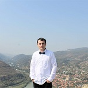
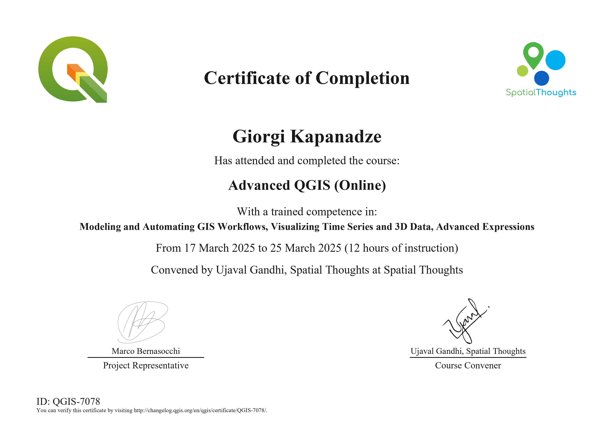

{ align=left }  
გიორგი კაპანაძე

🎓 გეოგრაფიის მაგისტრი — გეოგრაფიული ინფორმაციული სისტემების ტექნოლოგიაში.  

📚 დოქტორანტი: "წყლის რესურსების ინჟინერია" — საქართველოს ტექნიკურ უნივერსიტეტში.  

🌍 ნახეთ ჩემი პროფილი [OSGeo-ზე](https://www.osgeo.org/member/kapanadze/) ან [Linkedin-ზე](https://www.linkedin.com/in/ezdanapak/)  

🎓🎓🏫👨‍🏫

🌟 საქართველოს კარტოგრაფთა ასოციაციის სამეცნიერო საბჭოს წევრი. 🌟  

📞 (+995) 579320618  
თუ საქმე გადაუდებელია, გამომიგზავნე SMS ან დამირეკე ამ ნომერზე.    
📧 giorgi.kapanadze@gtu.ge — დამიკავშირდი პირდაპირ ელფოსტით ან გამოიყენე „პირდაპირი შეტყობინებები“.  

📘 დამოწმებული QGIS ასოციაციის მიერ    
{ align=left }
