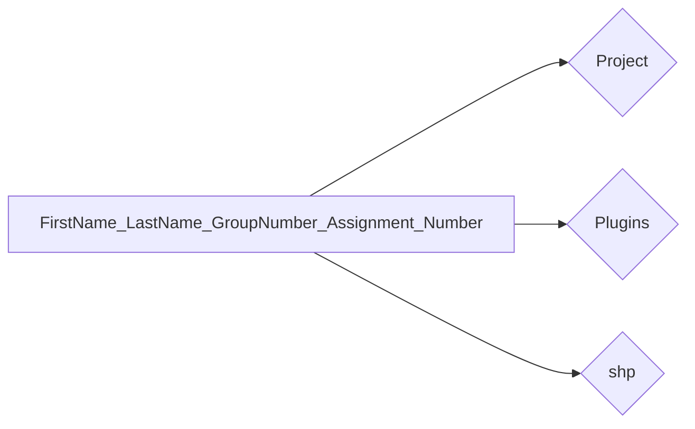

<!-- https://cloud.mail.ru/public/js3t/PQ6wiuvrC -->
# დიგიტალიზაცია

ვიდეო ჩანაწერებს ნახავ [აქ](https://ezdanapak.github.io/GTU-GIS/GIS_SKA/Videos/)  

ოფიციალური დოკუმენტაცია  

QGIS Documentation - [Editing](https://docs.qgis.org/3.40/en/docs/user_manual/working_with_vector/editing_geometry_attributes.html)  

ფანჯარა - The Browser [panel](https://docs.qgis.org/3.40/en/docs/user_manual/introduction/browser.html#resources-that-can-be-opened-run-from-the-browser)  

### ⚙️ Processing Toolbox

ინდექსაცია ცხრილური და [სივრცული](https://docs.qgis.org/3.40/en/docs/user_manual/processing_algs/qgis/vectorgeneral.html#create-spatial-index)

დამატებითი ბმულები  
თეორიული ნაწილი ინახება [აქ](https://ezdanapak.github.io/GTU-GIS/GIS_SKA/Theory/Digitization/)  
დამატებით ამავე [საკითხებზე](https://ezdanapak.github.io/GTU-GIS/GIS_SKA/Theory/Project_file/)  
Shapefile - ის [შესახებ](https://ezdanapak.github.io/GTU-GIS/GIS_SKA/Theory/Shapefile/)  
თეორიული ნაწილი ბილიკების - [შესახებ](https://ezdanapak.github.io/GTU-GIS/GIS_SKA/Theory/Path/)  

---
## დავალების ინსტრუქციები

⚠️ **სამუშაო გარემო**

უნივერსიტეტის კომპიუტერებზე იმუშავეთ შემდეგ საქაღალდეში:  
`C:\Users\Public\` ან `C:\Users\Public\Documents`  
*(რეკომენდებულია პირად კომპიუტერებზეც, რადგან პროგრამას სხვა ადგილას არსებული ფაილების დამუშავება შესაძლოა გაუჭირდეს.)*

📦 **საჭირო პროგრამები**

* QGIS – აუცილებელია ✅  
* Google Earth – სურვილისამებრ (დავალების მიხედვით) ✅  

---

!!!warning
    დასრულებული მასალა არ წაშალოთ სემესტრის ბოლომდე.
    
---

!!!danger 
    **ფაილების დასახელების წესები**

    ❌ **არასწორი:**  

    Giorgi Kapanadze.Group/1$ work1  

    ❌ არ გამოიყენოთ:

    - ქართული ასოები (ა, ბ, გ, დ და სხვ.)  
    - სპეციალური სიმბოლოები (გარდა ხაზგასმისა `_`)

    ✅ **სწორი:**  

    Giorgi_Kapanadze_Group_1_work_1  

!!!tip
    გამოიყენეთ მხოლოდ ლათინური ასოები, ციფრები და ხაზგასმა (`_`) შემდეგ შემთხვევებში:  
    არქივის სახელები, საქაღალდეებისა და ფაილების სახელები, ცხრილის სვეტების სახელები.

---

## 📘 ეტაპობრივი სახელმძღვანელო

!!!note
    მონაცემების ჩამოსატვირთად და დავალების ასატვირთად საჭიროა ავტორიზაცია გუგლის საკლასო ოთახზე
     : [classroom.google.com](https://classroom.google.com/)

=== "I ეტაპი: საქაღალდის მოწყობა"
* QGIS - ში დააინსტალირეთ ფლაგინი [HCMGIS](https://plugins.qgis.org/plugins/HCMGIS/) და 
[QuickMapServices](https://plugins.qgis.org/plugins/quick_map_services/) საბაზისო რუკებისთვის.
* შექმენით საქაღალდე თქვენი სახელისა და გვარის გამოყენებით. დაიცავით ზემოთ მოცემული სახელდების წესები.
* მის შიგნით შექმენით შემდეგი ქვე-საქაღალდეები:  
  - Project  
  - Plugins
  - shp  

დააკავშირეთ QGIS (Browser ფანჯრიდან) თქვენს მთავარ საქაღალდესთან.

---

=== "II ეტაპი: Shapefile-ების შექმნა"

**დამატებითი ინფორმაცია**

* **თბილისის მუნიციპალიტეტის ციფრული დამუშავება აკრძალულია.** გთხოვთ, აირჩიოთ სხვა ქალაქი ან სოფელი.  
დასახლების შერჩევის შემდეგ, თუ ზუსტად ზონის საზღვარზე იმყოფებით და გაურკვეველია რომელ ზონას მიეკუთვნებით:

    თუ ობიექტების უმეტესობა, რომელსაც აპირებთ რომ დაამუშავოთ, მდებარეობს ზონა 37-ში — აირჩიეთ 37.

    თუ უმეტესობა მდებარეობს ზონა 38-ში — აირჩიეთ 38.

    თუ ადგილმდებარეობა შუაშია და ობიექტები თანაბრად ნაწილდება — აირჩიეთ 38.

    უპირატესობა ენიჭება ზონა 38-ს.

**საბაზისო ინფორმაცია**

* მიანიჭეთ ფენებს ზუსტი სახელები და შეინახეთ შესაბამის საქაღალდეში. ფენების შაბლონი მოცემულია ქვემოთ:
    - **წერტილოვანი გეომეტრია**: სახლები, სკოლები, სადგურები, შენობები, სტადიონები
    - **ხაზოვანი გეომეტრია**: მდინარეები, რკინიგზები, გზები, საბაგირო გზები
    - **პოლიგონური გეომეტრია**: ნაკვეთები, სახლები, შენობები, სტადიონები, ტყეები

* თითოეულ ფენაში უნდა იყოს მინიმუმ **10 ობიექტი**, მაქსიმუმზე შეზღუდვა არ არსებობს.  
თუ რომელიმე ფენაში მონაცემები არასაკმარისია, გადადით სხვა ფენაზე და შეავსეთ ის.

* სიმბოლოების ფერის ან ფორმის არჩევა არ იზღუდება — შეგიძლიათ გამოიყენოთ თქვენი ხედვით.  
თუმცა, ტყის ლურჯად ან მდინარის მწვანედ აღნიშვნა არარელევანტურად ჩაითვლება.

* სწორად შეარჩიეთ მონაცემებისთვის შესაბამისი **UTM ზონა**.

* ციფრულად დამუშავებული მონაცემები ფენებში სწორად შეინახეთ.

* ფენები პროექტში ორგანიზებულად განათავსეთ.

* პროექტის კომპრესირებული ფაილი შეინახეთ სახელით: `"Digitalization_project.qgz"`.  
პროექტის არაკომპრესირებული ფაილი შეინახეთ სახელით: `"Digitalization_project.qgs"`.

---

=== "III ეტაპი: შემოწმება და გაგზავნა"
* გააკეთეთ არქივი თქვენს საქაღალდეზე. 💾
* გამოიყენეთ `.rar` ან `.zip` ფორმატები.
* დაარქვით არქივს შემდეგი ფორმატით:  
  `FirstName_LastName_GroupNumber_Assignment_Number`

* ატვირტეთ გუგლის საკლასო ოთახში ნამუშევარი

---

!!!warning
    თუ გაგზავნის პროცესში შეგექმნათ რაიმე პრობლემა, დაგვიკავშირდით:  
    g.kapanadze1908@gmail.com  
    ან გამოიყენეთ ნებისმიერი ფაილგადაცემის სერვისი.  

    https://www.swisstransfer.com/en-gb

    https://wetransfer.com/

    https://www.filemail.com/

    https://dropmefiles.com/

    https://www.swisstransfer.com/en-gb

    https://www.sendgb.com/

    https://workupload.com/ 

!!!info
    📌 თუ რაიმე გაუგებარია, თამამად იკითხე! 😊  
    თუ რამე არასწორადაა შესრულებული, გავასწორებ — ან თავად შექმენი pull request. 