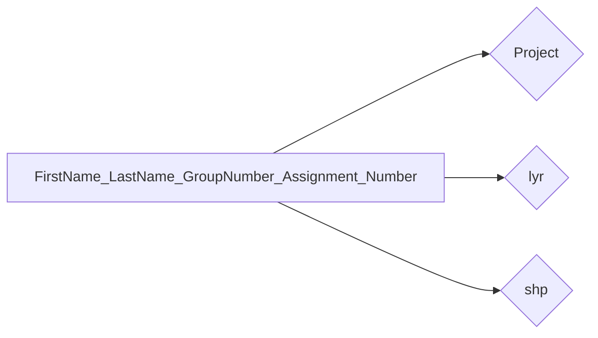

# დიგიტალიზაცია

---
## დავალების ინსტრუქციები

⚠️ **სამუშაო გარემო**

უნივერსიტეტის კომპიუტერებზე იმუშავეთ შემდეგ საქაღალდეში:  
`C:\Users\Public\` ან `C:\Users\Public\Documents`  
*(რეკომენდებულია პირად კომპიუტერებზეც, რადგან პროგრამას სხვა ადგილას არსებული ფაილების დამუშავება შესაძლოა გაუჭირდეს.)*

📦 **საჭირო პროგრამები**

* QGIS – აუცილებელია ✅  
* Google Earth – სურვილისამებრ (დავალების მიხედვით) ✅  

---

!!!warning
    დასრულებული მასალა არ წაშალოთ სემესტრის ბოლომდე.
    
---

!!!danger 
    **ფაილების დასახელების წესები**

    ❌ **არასწორი:**  

    Giorgi Kapanadze.Group/1$ work1  

    ❌ არ გამოიყენოთ:

    - ქართული ასოები (ა, ბ, გ, დ და სხვ.)  
    - სპეციალური სიმბოლოები (გარდა ხაზგასმისა `_`)

    ✅ **სწორი:**  

    Giorgi_Kapanadze_Group_1_work_1  

!!!tip
    გამოიყენეთ მხოლოდ ლათინური ასოები, ციფრები და ხაზგასმა (`_`) შემდეგ შემთხვევებში:  
    არქივის სახელები, საქაღალდეებისა და ფაილების სახელები, ცხრილის სვეტების სახელები.

---

## 📘 ეტაპობრივი სახელმძღვანელო

!!!note
    მონაცემების ჩამოსატვირთად და დავალების ასატვირთად საჭიროა ავტორიზაცია გუგლის საკლასო ოთახზე
     : [classroom.google.com](https://classroom.google.com/)

=== "I ეტაპი: საქაღალდის მოწყობა"
* ჩამოტვირთეთ Basemap ფაილები [აქედან](https://elearning.gtu.ge/pluginfile.php/572869/mod_folder/content/0/Basemaps_lyr.zip?forcedownload=1)
* შექმენით საქაღალდე თქვენი სახელისა და გვარის გამოყენებით. დაიცავით ზემოთ მოცემული სახელდების წესები.
* მის შიგნით შექმენით შემდეგი ქვე-საქაღალდეები:  
  - Project  
  - lyr 
  - shp  

დააკავშირეთ QGIS (Browser ფანჯრიდან) თქვენს მთავარ საქაღალდესთან.

---

=== "II ეტაპი: Shapefile-ების შექმნა"

**დამატებითი ინფორმაცია**

* **თბილისის მუნიციპალიტეტის ციფრული დამუშავება აკრძალულია.** გთხოვთ, აირჩიოთ სხვა ქალაქი ან სოფელი.  
დასახლების შერჩევის შემდეგ, თუ ზუსტად ზონის საზღვარზე იმყოფებით და გაურკვეველია რომელ ზონას მიეკუთვნებით:

    თუ ობიექტების უმეტესობა, რომელსაც აპირებთ რომ დაამუშავოთ, მდებარეობს ზონა 37-ში — აირჩიეთ 37.

    თუ უმეტესობა მდებარეობს ზონა 38-ში — აირჩიეთ 38.

    თუ ადგილმდებარეობა შუაშია და ობიექტები თანაბრად ნაწილდება — აირჩიეთ 38.

    უპირატესობა ენიჭება ზონა 38-ს.

**საბაზისო ინფორმაცია**

* მიანიჭეთ ფენებს ზუსტი სახელები და შეინახეთ შესაბამის საქაღალდეში. ფენების შაბლონი მოცემულია ქვემოთ:
    - **წერტილოვანი გეომეტრია**: სახლები, სკოლები, სადგურები, შენობები, სტადიონები
    - **ხაზოვანი გეომეტრია**: მდინარეები, რკინიგზები, გზები, საბაგირო გზები
    - **პოლიგონური გეომეტრია**: ნაკვეთები, სახლები, შენობები, სტადიონები, ტყეები

* თითოეულ ფენაში უნდა იყოს მინიმუმ **10 ობიექტი**, მაქსიმუმზე შეზღუდვა არ არსებობს.  
თუ რომელიმე ფენაში მონაცემები არასაკმარისია, გადადით სხვა ფენაზე და შეავსეთ ის.

* სიმბოლოების ფერის ან ფორმის არჩევა არ იზღუდება — შეგიძლიათ გამოიყენოთ თქვენი ხედვით.  
თუმცა, ტყის ლურჯად ან მდინარის მწვანედ აღნიშვნა არარელევანტურად ჩაითვლება.

* სწორად შეარჩიეთ მონაცემებისთვის შესაბამისი **UTM ზონა**.

* ციფრულად დამუშავებული მონაცემები ფენებში სწორად შეინახეთ.

* ფენები პროექტში ორგანიზებულად განათავსეთ.

* პროექტის ფაილი შეინახეთ სახელით: `"Digitalization_project"`.  
ძველი ვერსიებისთვის შეინახეთ `"Digitalization_project10.0v"`.

=== "Step III: Final Checks & Submission"

* Compress (zip) your folder (named after your first and last name). 💾
* Use formats like `.rar` or `.zip`.
* Name the archive as:  
  `FirstName_LastName_GroupNumber_Assignment_Number`

* Send it to: giorgi.kapanadze@gtu.ge

---

!!!warning
    If you experience any issues with the submission process, contact:  
    giorgi.kapanadze@gtu.ge  
    Or use any file transfer services.

!!!info
    📌 If anything is unclear, feel free to ask! 😊  
    If something here was done incorrectly, I’ll correct it — or you can create a pull request. 