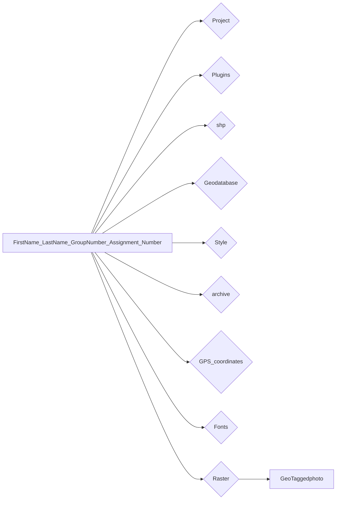

# გლობალური პოზიციონირების სისტემები

ვიდეო ჩანაწერებს ნახავ [აქ](https://ezdanapak.github.io/GTU-GIS/GIS_SKA/Videos/)  

ოფიციალური დოკუმენტაცია  

დროებითი შრე - Creating a new Temporary Scratch [Layer](https://docs.qgis.org/3.40/en/docs/user_manual/managing_data_source/create_layers.html#creating-a-new-temporary-scratch-layer)  
ფანჯარა - The Browser [panel](https://docs.qgis.org/3.40/en/docs/user_manual/introduction/browser.html#resources-that-can-be-opened-run-from-the-browser)  

### ⚙️ Processing Toolbox  

ხელსაწყო [Import geotagged photos](https://docs.qgis.org/3.40/en/docs/user_manual/processing_algs/qgis/vectorcreation.html#import-geotagged-photos)  
ხელსაწყო [Add geometry attributes](https://docs.qgis.org/3.40/en/docs/user_manual/processing_algs/qgis/vectorgeometry.html#qgisexportaddgeometrycolumns)  
ხელსაწყო [Reproject layer](https://docs.qgis.org/3.40/en/docs/user_manual/processing_algs/qgis/vectorgeneral.html#qgisreprojectlayer)  

დამატებითი ბმულები  
SVG [მარკერები](https://www.svgrepo.com/)  
ვექტორული შრის [შენახვა](https://ezdanapak.github.io/GTU-GIS/GIS_SKA/Theory/Save_vector_layer/)  
დროებითი შრე - Creating a new Temporary Scratch [Layer](https://ezdanapak.github.io/GTU-GIS/GIS_SKA/Theory/Scratch_layer/)  
სტილები [QML&SLD](https://ezdanapak.github.io/GTU-GIS/GIS_SKA/Theory/QML_SLD/)  

დანამატები - Plugins  
დანამატი [ImportPhotos](https://plugins.qgis.org/plugins/ImportPhotos/)  

გარკვეული მასალები ინახება გუგლის საკლასო [ოთახში](https://classroom.google.com/c/Nzg3MzAxMDU4MzEy/m/Nzg3NTk5MzU2OTYw/details) ⚠️  

---
## დავალების ინსტრუქციები

⚠️ **სამუშაო გარემო**

უნივერსიტეტის კომპიუტერებზე იმუშავეთ შემდეგ საქაღალდეში:  
`C:\Users\Public\` ან `C:\Users\Public\Documents`  
*(რეკომენდებულია პირად კომპიუტერებზეც, რადგან პროგრამას სხვა ადგილას არსებული ფაილების დამუშავება შესაძლოა გაუჭირდეს.)*

📦 **საჭირო პროგრამები**

* QGIS – აუცილებელია ✅  
* Google Earth – სურვილისამებრ (დავალების მიხედვით) ✅  

---

!!!warning
    დასრულებული მასალა არ წაშალოთ სემესტრის ბოლომდე.
    
---

!!!danger 
    **ფაილების დასახელების წესები**

    ❌ **არასწორი:**  

    Giorgi Kapanadze.Group/1$ work1  

    ❌ არ გამოიყენოთ:

    - ქართული ასოები (ა, ბ, გ, დ და სხვ.)  
    - სპეციალური სიმბოლოები (გარდა ხაზგასმისა `_`)

    ✅ **სწორი:**  

    Giorgi_Kapanadze_Group_1_work_1  

!!!tip
    გამოიყენეთ მხოლოდ ლათინური ასოები, ციფრები და ხაზგასმა (`_`) შემდეგ შემთხვევებში:  
    არქივის სახელები, საქაღალდეებისა და ფაილების სახელები, ცხრილის სვეტების სახელები.

---

## 📘 ეტაპობრივი სახელმძღვანელო

!!!note
    მონაცემების ჩამოსატვირთად და დავალების ასატვირთად საჭიროა ავტორიზაცია გუგლის საკლასო ოთახზე
     : [classroom.google.com](https://classroom.google.com/)

=== "I ეტაპი: საქაღალდის ორგანიზება"
* ვიყენებთ წინა დავალებას **გეომონაცემთა ბაზები [task](https://ezdanapak.github.io/GTU-GIS/GIS_SKA/Lab/Geodatabase/)**

* მის შიგნით შექმენით შემდეგი ქვე-საქაღალდეები:  
    - archive
    - GPS_coordinates 
    - Fonts
    - GeoTaggedphoto 

დააკავშირეთ QGIS (Browser ფანჯრიდან) თქვენს მთავარ საქაღალდესთან.

---

=== "ნაბიჯი II: პრაქტიკული ამოცანების შესრულება"

* გახსენით `"Chiatura_Geodatabase_project.qgz"` ფაილი საქაღალდიდან და შეინახეთ ასლი სახელით `"Chiatura_GPS_project.qgz"` და დამატებით შეინახეთ სხვა `.qgs` ფაილი `"Chiatura_GPS_project.qgs"`
* ფონტები, ინსტალაცია, მათი მნიშვნელობა, გამოყენება წარწერებზე.
* GPS კოორდინატები მასალიდან დააკონვერტირეთ შესაბამის ფორმატში, შემოიტანეთ პროგრამაში დასვით შესაბამის საკოორდინატო სისტემაში,
შეინახეთ ექსპორტზე თითოეული მათგანი როგორც shapefile, ან გეომონაცემთა ბაზის Feature class.  
* შემოიტანეთ კოორდინატებიანი ფოტოსურათები (Geotaggedphotos) როგორც shapefile, ან როგორც გეომონაცემთა ბაზის Feature class.  
* გარდაქმენით ფოტოების შრე PT Assign projection ელიფსოიდიდან UTM ზონაში და გამოთვალეთ XY კოორდინატები Add geometry attributes შრის ცხრილში.  
* აიღეთ ფოტო კოორდინატების გარეშე და დამატებითი ხელსაწყოების დახმარებით მიანიჭეთ ადგილმდებარეობა [geoimgr](https://tool.geoimgr.com/), [GEOSETTER](https://geosetter.de/en/main-en/).  
* SVG მარკერები, ჩამოწერა თავისუფალი წვდომით, შენახვა და გამოყენება წერტილოვან გეომეტრიაზე ხატულად.  
* შეინახე შრის სტილი როგორც QGIS qml ფორმატში ასევე SLD ფაილად.  
* შეინახეთ პროექტის ფაილი სახელით `"Chiatura_GPS_project.qgz"`. ასევე შეინახეთ  `"Chiatura_GPS_project.qgs"` ფორმატში.  

---

=== "ეტაპი IV: შემოწმება და გაგზავნა"
* გააკეთეთ არქივი თქვენს საქაღალდეზე. 💾
* გამოიყენეთ `.rar` ან `.zip` ფორმატები.
* დაარქვით არქივს შემდეგი ფორმატით:  
  `FirstName_LastName_GroupNumber_Assignment_Number`

* ატვირტეთ გუგლის საკლასო ოთახში ნამუშევარი

---

!!!warning
    თუ გაგზავნის პროცესში შეგექმნათ რაიმე პრობლემა, დაგვიკავშირდით:  
    g.kapanadze1908@gmail.com  
    ან გამოიყენეთ ნებისმიერი ფაილგადაცემის სერვისი.  

    https://www.swisstransfer.com/en-gb

    https://wetransfer.com/

    https://www.filemail.com/

    https://dropmefiles.com/

    https://www.swisstransfer.com/en-gb

    https://www.sendgb.com/

    https://workupload.com/ 

!!!info
    📌 თუ რაიმე გაუგებარია, თამამად იკითხე! 😊  
    თუ რამე არასწორადაა შესრულებული, გავასწორებ — ან თავად შექმენი pull request.  

