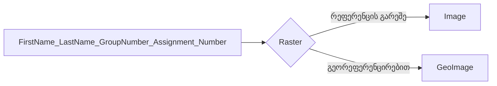

<!-- https://cloud.mail.ru/public/js3t/PQ6wiuvrC -->
# გეორეფერენცირება

---
## დავალების ინსტრუქციები

⚠️ **სამუშაო გარემო**

უნივერსიტეტის კომპიუტერებზე იმუშავეთ შემდეგ საქაღალდეში:  
`C:\Users\Public\` ან `C:\Users\Public\Documents`  
*(რეკომენდებულია პირად კომპიუტერებზეც, რადგან პროგრამას სხვა ადგილას არსებული ფაილების დამუშავება შესაძლოა გაუჭირდეს.)*

📦 **საჭირო პროგრამები**

* QGIS – აუცილებელია ✅  
* Google Earth – სურვილისამებრ (დავალების მიხედვით) ✅  

---

!!!warning
    დასრულებული მასალა არ წაშალოთ სემესტრის ბოლომდე.
    
---

!!!danger 
    **ფაილების დასახელების წესები**

    ❌ **არასწორი:**  

    Giorgi Kapanadze.Group/1$ work1  

    ❌ არ გამოიყენოთ:

    - ქართული ასოები (ა, ბ, გ, დ და სხვ.)  
    - სპეციალური სიმბოლოები (გარდა ხაზგასმისა `_`)

    ✅ **სწორი:**  

    Giorgi_Kapanadze_Group_1_work_1  

!!!tip
    გამოიყენეთ მხოლოდ ლათინური ასოები, ციფრები და ხაზგასმა (`_`) შემდეგ შემთხვევებში:  
    არქივის სახელები, საქაღალდეებისა და ფაილების სახელები, ცხრილის სვეტების სახელები.

---

## 📘 ეტაპობრივი სახელმძღვანელო

!!!note
    მონაცემების ჩამოსატვირთად და დავალების ასატვირთად საჭიროა ავტორიზაცია გუგლის საკლასო ოთახზე
     : [classroom.google.com](https://classroom.google.com/)

=== "I ეტაპი: საქაღალდის ორგანიზება"
* ჩამოტვირთეთ Basemap ფაილები [აქედან](https://elearning.gtu.ge/pluginfile.php/572869/mod_folder/content/0/Basemaps_lyr.zip?forcedownload=1)
* ჩამოტვირთეთ მონაცემები [აქედან](https://elearning.gtu.ge/pluginfile.php/572869/mod_folder/content/0/K-38-51-G-b.zip?forcedownload=1)
* შექმენით თქვენი სახელისა და გვარის საფუძველზე ახალი საქაღალდე. გამოიყენეთ ზემოთ მოცემული დასახელების წესები. მაგ: `"Giorgi_Kapanadze_Group_1_work_1_georeferencing"`  
* მის შიგნით შექმენით შემდეგი ქვე-საქაღალდეები:  
  - Raster  
  - Image  
  - Geoimage  

დააკავშირეთ QGIS (Browser ფანჯრიდან) თქვენს მთავარ საქაღალდესთან.

---

=== "II ეტაპი: რუკის მომზადება"
* დავალების საქაღალდეში მოთავსებულია ერთი ტოპოგრაფიული რუკა.
* ჩამოტვირთეთ და განათავსეთ შესაბამის ქვე-საქაღალდეში.
* განახორციელეთ გეორეფერენცირება მართკუთხა კოორდინატებით (მეტრებში).
* განახორციელეთ გეორეფერენცირება სფერული კოორდინატებით (Degrees, Minutes, seconds).

---

=== "III ეტაპი: შემოწმება და გაგზავნა"
* გეორეფერენცირების შემდეგ გადაამოწმეთ რუკის მდებარეობა ნებისმიერი ხელმისაწვდომი მეთოდით — შეგიძლიათ გამოიყენოთ Google Earth 
ან QGIS და არ დაგავიწყდეს პირველ რიგში იმპორტით ნებისმიერი საბაზისო რუკის შემოტანა.. 🌍
* დარწმუნდით, რომ რუკა სწორად ემთხვევა მიზნობრივ ტერიტორიას. 🗺
* გააკეთეთ არქივი თქვენს საქაღალდეზე. 💾
* გამოიყენეთ `.rar` ან `.zip` ფორმატები.
* დაარქვით არქივს შემდეგი ფორმატით:  
  `FirstName_LastName_GroupNumber_Assignment_Number`

* ატვირტეთ გუგლის საკლასო ოთახში ნამუშევარი

---

!!!warning
    თუ გაგზავნის პროცესში შეგექმნათ რაიმე პრობლემა, დაგვიკავშირდით:  
    g.kapanadze1908@gmail.com  
    ან გამოიყენეთ ნებისმიერი ფაილგადაცემის სერვისი.  

    https://www.swisstransfer.com/en-gb

    https://wetransfer.com/

    https://www.filemail.com/

    https://dropmefiles.com/

    https://www.swisstransfer.com/en-gb

    https://www.sendgb.com/

    https://workupload.com/ 

!!!info
    📌 თუ რაიმე გაუგებარია, თამამად იკითხე! 😊  
    თუ რამე არასწორადაა შესრულებული, გავასწორებ — ან თავად შექმენი pull request. 

