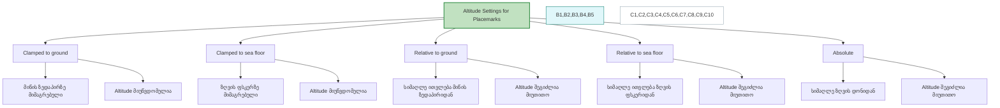

# Placemark-ის სიმაღლის პარამეტრები (Altitude Settings)

**Placemark-ის სიმაღლის პარამეტრები განსაზღვრავს, თუ რომელი რეფერენცული დონიდან ითვლება სიმაღლე 3D რუკაზე (მაგ. Google Earth-ში).**

---

## 1. `Clamped to ground` — მიწაზე მიკრული

- 📌 **აღწერა:** წერტილი პირდაპირ მიეკრობა მიწის ზედაპირს (გეოიდს).
- ⛔ სიმაღლის (Altitude) ხელით შეყვანა **შეუძლებელია**.
- 🧭 **მაგალითი:** მონიშნე ხე ბორცვზე — ის გამოჩნდება მიწაზე, ბორცვის ზემოთ.

---

## 2. `Clamped to sea floor` — ზღვის ფსკერზე მიკრული

- 📌 **აღწერა:** წერტილი განთავსდება ზღვის ფსკერზე, არა წყლის ზედაპირზე.
- ⛔ სიმაღლის შეყვანა **შეუძლებელია**.
- 🧭 **მაგალითი:** თუ გსურს წყალქვეშა გემის ჩაძირვის ადგილი აჩვენო, ის გამოჩნდება ფსკერზე.

---

## 3. `Relative to ground` — მიწის ზედაპირიდან მიმართებით

- 📌 **აღწერა:** სიმაღლე ითვლება მიწის ზედაპირიდან.
- ✅ შეგიძლია მიუთითო კონკრეტული მეტრი/ფუტი.
- 🧭 **მაგალითი:** "100 მ" ნიშნავს, რომ წერტილი ზედაპირიდან 100 მეტრზე გამოჩნდება — მაგალითად, დრონი ან კოშკი.

---

## 4. `Relative to sea floor` — ზღვის ფსკერიდან მიმართებით

- 📌 **აღწერა:** სიმაღლე ითვლება ზღვის ფსკერიდან.
- ✅ შეგიძლია მიუთითო, რამდენი მეტრით არის ფსკერიდან მაღლა.
- 🧭 **მაგალითი:** წყალქვეშა რობოტი 20 მეტრის სიმაღლეზე ფსკერიდან.

---

## 5. `Absolute` — აბსოლუტური (ზღვის დონიდან)

- 📌 **აღწერა:** სიმაღლე განისაზღვრება ზღვის დონიდან (Mean Sea Level - MSL).
- ✅ მეტრის მნიშვნელობა არის აბსოლუტური სიმაღლე, როგორც რუკის გლობალურ მოდელზე.
- 🧭 **მაგალითი:** "2000 მ" ნიშნავს, რომ წერტილი ისეთ სიმაღლეზეა, როგორც ბახმარო ან გუდაური.

---

📎 **შენიშვნა:**  
Google Earth-ში ეს პარამეტრები განსაკუთრებით მნიშვნელოვანია 3D ობიექტების, ხილვადობის ან ანიმაციების სწორად განსაზღვრისთვის.

# Placemark-ის სიმაღლის პარამეტრები — Mermaid დიაგრამით

