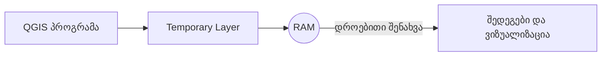

# 📘 გაგება RAM-ის და QGIS-ის დროებითი ფენების

## 💡 რა არის RAM?

**RAM (Random Access Memory)** არის კომპიუტერის მოკლევადიანი მეხსიერება.  
ის დროებით ინახავს იმ პროგრამებისა და ფაილების მონაცემებს, რომლებიც ამჟამად მუშაობს.

- როგორც სამუშაო მაგიდა – რაც უფრო დიდია, უფრო მეტი რამ შეიძლება იყოს გაშლილი ერთდროულად.
- პროგრამები, როგორიცაა **QGIS**, იყენებენ RAM-ს მონაცემების დამუშავებისა და დროებითი შედეგების შესანახად.
- როდესაც კომპიუტერი ან პროგრამა გამოირთვება, **RAM-ის შიგთავსი იშლება**.

> 📌 **მაგალითი**: როცა QGIS-ში ქმნი ახალ პროექტს და მასში ატვირთავ რუკას, რუკა დროებით ინახება RAM-ში, სანამ შენ არ შეინახავ ფაილს დისკზე.

---

## 📍 რატომ არის RAM მნიშვნელოვანი QGIS-ისთვის?

- QGIS მუშაობს სივრცულ მონაცემებთან, რომლებიც შესაძლოა საკმაოდ დიდი იყოს.
- ხანდახან საჭიროა **დროებითი ფენა**, რომელიც არ ინახება შენს კომპიუტერში, არამედ მხოლოდ RAM-ში.
- ასეთი ფენა არის **Temporary Scratch Layer**.

---

## 🧪 Temporary Scratch Layer QGIS-ში

**Temporary Scratch Layer** არის დროებითი ფენა, რომელიც:
- ინახება მხოლოდ კომპიუტერის RAM-ში
- ქრება როცა პროექტს დახურავ (თუ არ შეინახე)
- გამოიყენება სწრაფი ტესტირებისთვის, ხატვისთვის, ან თუნდაც გამოთვლების შედეგების დროებით შესანახად

> 🧠 **ანალოგია**: Temporary Layer არის როგორც ჩანაწერი ფურცელზე, რომელიც წაიშლება როცა ოთახს დატოვებ — თუ არ გადაიტანე მუდმივ რვეულში.

---

## ✅ როდის უნდა გამოვიყენოთ Scratch Layer?

- როცა გინდა სწრაფად დახატო ახალი ობიექტი (მაგ. წერტილი ან პოლიგონი) გამოსაცდელად
- როცა მონაცემები გჭირდება მხოლოდ ამ სესიის განმავლობაში
- როცა აკეთებ spatial analysis-ს და შედეგი დროებითია

---

## ❗ გახსოვდეს:

- Temporary Layer **არ ინახება ავტომატურად** – შენ თვითონ უნდა შეინახო (Export → Save Features As…) თუ გინდა რომ ფაილად დარჩეს.
- თუ დახურავ QGIS-ს – ფენა **წაიშლება**.

---

## 🔁 RAM და Scratch Layer-ის კავშირი

| კომპონენტი       | ფუნქცია                                                         |
|------------------|------------------------------------------------------------------|
| RAM              | დროებითი მონაცემების შენახვა კომპიუტერში                         |
| Scratch Layer     | დროებითი სივრცული ფენა, რომელიც ინახება RAM-ში QGIS-ის მუშაობისას |

---

## 📷 ვიზუალური მაგალითი:

---

## 📎 დამატებითი რესურსები:
- [GeeksForGeeks: What is RAM?](https://www.geeksforgeeks.org/computer-science-fundamentals/random-access-memory-ram/)
- [QGIS Documentation: Temporary Layers](https://docs.qgis.org/3.40/en/docs/user_manual/managing_data_source/create_layers.html#creating-a-new-temporary-scratch-layer)
